# Processing 🐮🐷🧑 with DIALS (SLAC 2026)

## Introduction

DIALS data processing may be run by automated tools such as `xia2`, interactively on the command line, or - as in this tutorial - through the **DIALS Workflow GUI**, which drives the same command-line programs from a set of panels. For a tutorial it is more useful to run the steps one at a time, to explain the opportunities afforded by the software. In any data processing package the workflow requires reading data, finding spots, indexing to get an orientation matrix, refinement, integration and then scaling / correction: DIALS is no different.

This tutorial deviates slightly from the mainstream by _starting_ with data from a number of crystals, first from a single sample type and then from a mixture, which will show you how to classify data with subtle differences (e.g. presence or absence of a ligand.)

Throughout, the GUI shows the command it is about to run in blue under **Command** - this is exactly what you would type in a terminal, so the [original command-line version of this tutorial](../ccp4-dls-2024/COWS_PIGS_PEOPLE.md) can be followed side by side. The GUI itself is introduced in the [workflow tutorial](./WORKFLOW.md), which is worth reading first if you have not used it before.

## The Data

[The data](https://zenodo.org/records/13890874) (~6GB) were taken on i24 at Diamond Light Source as part of routine commissioning work, with a number of small rotation data sets recorded from different crystals. Crystals were prepared of the protein insulin from cows, pigs and people (as described on the Zenodo deposition; bovine, porcine and human insulin, of course all grown in e-coli anyway).

All data have symmetry I213 and very similar unit cell constants so you can _try_ to merge them together and it will work, but won't give you good results as you will be measuring a mixture of structures. The data on the deposition are in `tar` archives so I am assuming you have already downloaded them all and unpacked them into `../data`: if you have done something different you will need to take a little care at the import stage.

If you are at the workshop in real life, the data are already in:

```
/dls/i04/data/2024/mx39148-1/tutorial_data/cows_pigs_people
```

so you don't need to download the data - but you'll need to use this path in place of `../data` - you do not need to follow these instructions here.

If you don't already have the data downloaded, you can do this with this script on linux / UNIX:

```
mkdir data
cd data
for set in CIX1_1 CIX2_1 CIX3_1 CIX5_1 CIX6_1 CIX8_1 CIX9_1 CIX10_1 CIX11_1 CIX12_1 CIX14_1 CIX15_1 PIX5_1 PIX6_1 PIX7_1 PIX8_1 PIX9_1 PIX10_1 PIX11_1 PIX12_1 PIX13_1 PIX14_1 PIX15_1 PIX16_1 X1_1 X2_1 X3_1 X4_1 X5_1 X6_1 X7_1 X8_1 X9_1 X11_1 X13_1 X14_1 ; do
wget https://zenodo.org/records/13890874/files/${set}.tar
tar xvf ${set}.tar
rm -v ${set}.tar
done
```

## The Workflow

The [workflow](./WORKFLOW.md) is the same with one data set as with many, with some small deviations - data from multiple crystals will not in general share an orientation matrix so the indexing will need to _not_ join all the lattices.

As mentioned above the flow is to read the data, find spots, index, refine, integrate and then derive some corrections from symmetry related reflections, which involves assigning the symmetry. In DIALS we use the following tools, each of which has a numbered step in the GUI's **Pipeline steps** list:

- `dials.import` (**1. Import**) - read all the image headers to make sense of the metadata
- `dials.find_spots` (**2. Find Spots**) - find the spots - with DIALS we find spots across the whole data set and one spot across multiple images is "found" in 3D
- `dials.index` (**4. Index**) - assign indices to the spots and derive unit cell, symmetry
- `dials.refine` (**6. Refine**) - improve the models from indexing (separate as allows "wobbles")
- `dials.integrate` (**7. Integrate**) - measure the background subtracted spot intensity
- `dials.symmetry` (**8. Symmetry**) - derive the Patterson symmetry of the crystal from the data
- `dials.scale` (**9. Scale**) - correct the data for sample decay, overall scale from beam or illuminated volume and absorption
- `dials.export` (**10. Merge / Export**) - output processed data for e.g. use in CCP4 or PHENIX

With multiple sweeps from a single crystal, we can assign a single orientation matrix and then use this throughout the processing (the default) - however if you have data from multiple crystals some of the assumptions will break down so we need to (i) tell the software that the crystals _do not_ share a matrix and in the symmetry determination also resolve any indexing ambiguity: we therefore replace `dials.symmetry` with `dials.cosym` (**8b. Cosym**).

Launch the GUI and set the **Working directory** to a new, empty directory (here `Cows_only_GUI`) - all the output files below will be written there.

## Import

The data are in `../data`: for the first pass through this tutorial we will just process the "cow" data `CIX...` to keep things simple. There are data from 12 crystals in here. Click **1. Import** then **Browse files...**, navigate to the data directory and select all of the `CIX*.cbf.gz` images (click the first `CIX` file, then shift-click the last one - the `PIX` and `X` files below should stay unselected). Alternatively, **Add glob pattern...** with `../data/CIX*gz` does the same thing in one line, and is what you would type on the command line.

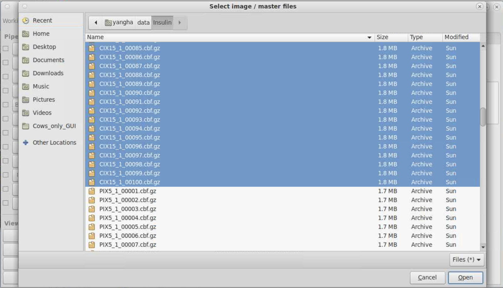

The 1200 selected files appear in the list (and in the very long command preview underneath). Leave the image range blank and click **Run dials.import** - `dials.import` will make sense of what it finds:

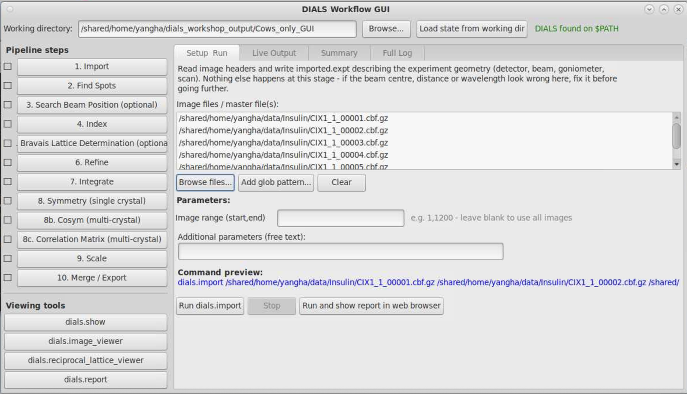

Reading 1200 image headers takes a minute or so, and at the end of the **Live Output** you get:

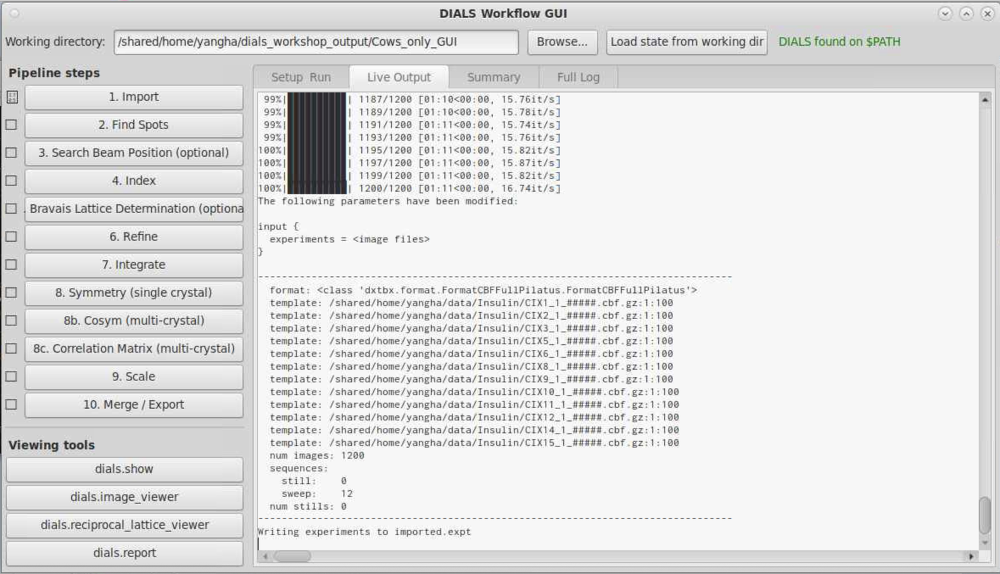

```
--------------------------------------------------------------------------------
  format: <class 'dxtbx.format.FormatCBFFullPilatus.FormatCBFFullPilatus'>
  template: /shared/home/yangha/data/Insulin/CIX1_1_#####.cbf.gz:1:100
  template: /shared/home/yangha/data/Insulin/CIX2_1_#####.cbf.gz:1:100
  template: /shared/home/yangha/data/Insulin/CIX3_1_#####.cbf.gz:1:100
  template: /shared/home/yangha/data/Insulin/CIX5_1_#####.cbf.gz:1:100
  template: /shared/home/yangha/data/Insulin/CIX6_1_#####.cbf.gz:1:100
  template: /shared/home/yangha/data/Insulin/CIX8_1_#####.cbf.gz:1:100
  template: /shared/home/yangha/data/Insulin/CIX9_1_#####.cbf.gz:1:100
  template: /shared/home/yangha/data/Insulin/CIX10_1_#####.cbf.gz:1:100
  template: /shared/home/yangha/data/Insulin/CIX11_1_#####.cbf.gz:1:100
  template: /shared/home/yangha/data/Insulin/CIX12_1_#####.cbf.gz:1:100
  template: /shared/home/yangha/data/Insulin/CIX14_1_#####.cbf.gz:1:100
  template: /shared/home/yangha/data/Insulin/CIX15_1_#####.cbf.gz:1:100
  num images: 1200
  sequences:
    still:    0
    sweep:    12
  num stills: 0
--------------------------------------------------------------------------------
Writing experiments to imported.expt
```

This shows the filename patterns, how many images for each and the total it found - 12 sweeps each of 100 images. We can get much more detail on this with the **dials.show** button under **Viewing tools**, which can print the "DIALS understanding" of what the data look like. There are ways to streamline this for very large numbers of images, but for now this is fine.

At this point: scan the output - do you have what you expected? Many problems with DIALS processing can be solved here.

## Spot Finding

Spot finding is exactly what it sounds like: finding where all the spots are in the data sets. In DIALS spots in the same place on adjacent images are considered to be joined so the spot is a three dimensional object. You can explore the spot finding by opening the images in the image viewer: click **dials.image_viewer** under **Viewing tools**, give it `imported.expt` and leave the reflection file blank, then **Launch**.

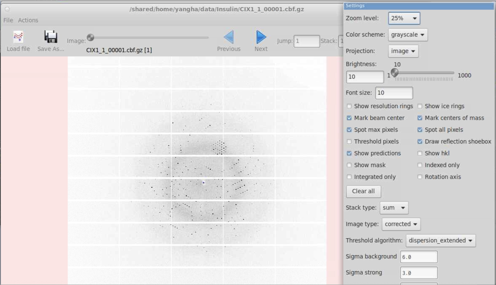

Then click through the options at the bottom of the Settings window (I will demo this in real life, and make a video, but you can click through the steps to "threshold" which is the set of pixels the spot finding will pick out). The spot finding itself is **2. Find Spots**: the experiment file is already `imported.expt`, so click **Run dials.find_spots**.

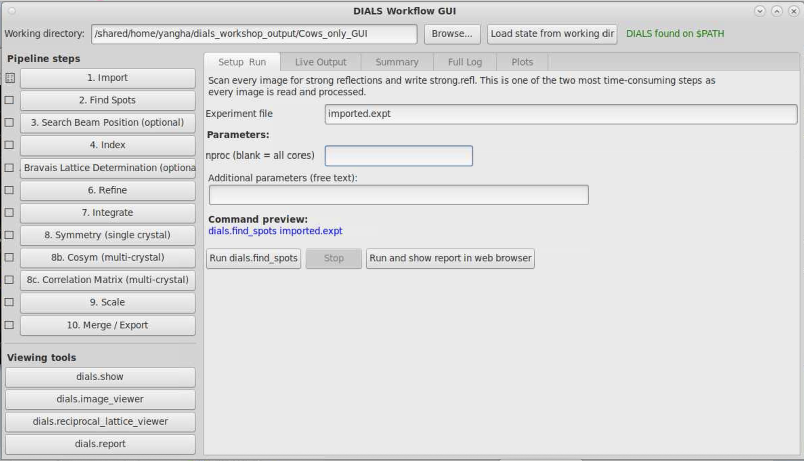

This will give a summary of the number of signal pixels on every image, the number of found spots on each run and at the end a histogram of the distribution of spots across the images on each run, as:

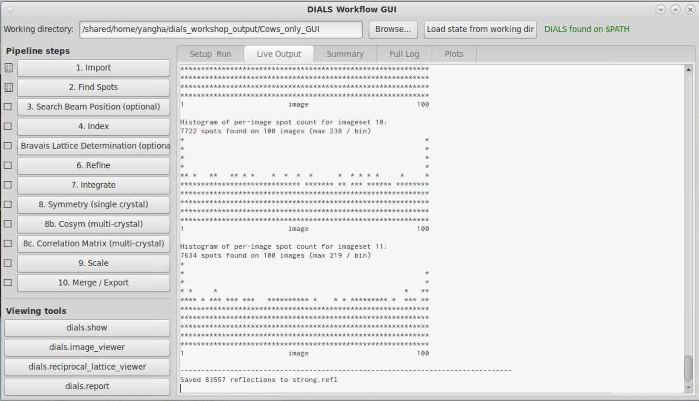

```
Histogram of per-image spot count for imageset 10:
7722 spots found on 100 images (max 238 / bin)
*                                                          *
*                                                          *
*                                                          *
*                                                          *
** *    **  ** * *     * *  * *       * * * * *     *      *
*************************** ******* ** *** ****** ********
************************************************************
************************************************************
************************************************************
************************************************************
1                         image                          100

Histogram of per-image spot count for imageset 11:
7634 spots found on 100 images (max 219 / bin)
*                                                           
*                                                          *
*                                                          *
* *     *                                             *  **
**** * *** *** ***   ********* *    * * ********** * *** **
********************************** *************************
************************************************************
************************************************************
************************************************************
************************************************************
1                         image                          100

--------------------------------------------------------------------------------
Saved 83557 reflections to strong.refl
```

You can also look at the spot finding result in the image viewer - **dials.image_viewer** again, this time with `strong.refl` in the reflection file box - which should look like:

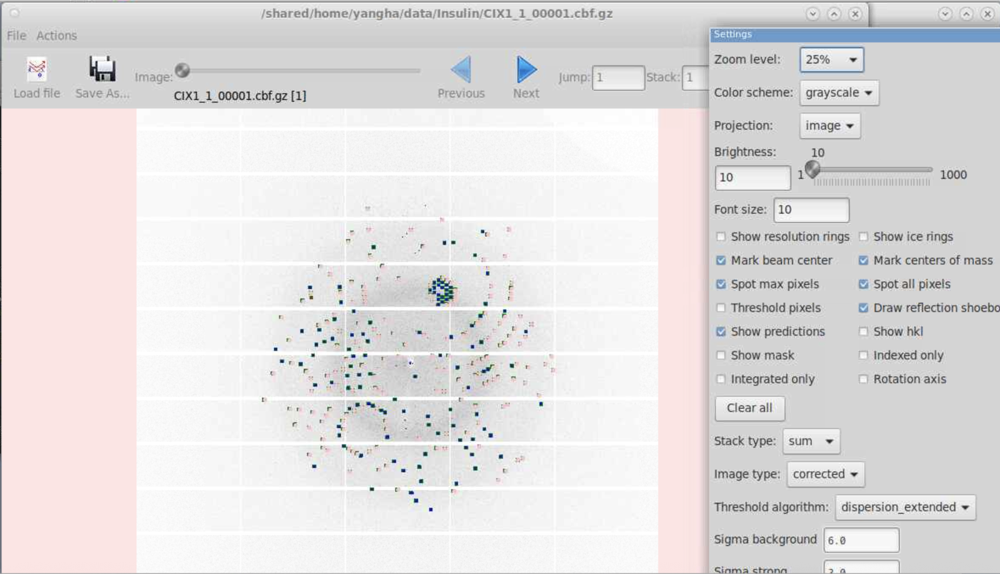

More details about the image viewer can be found [here](../ccp4-dls-2024/image_viewer.md). Now that we have found the spots we can start to consider some initial analysis - for example, looking at the distribution of the spots in reciprocal space. For a single scan we will see a single lattice, but in this case we will see the same 10° wedge many times, because right now we don't know anything about the reciprocal space orientation. You can pick out one lattice and rotate it, to see the actual reciprocal space orientations. You may want to run this in full-screen to see the options e.g. to select individual runs.

Open the reciprocal lattice view by clicking **dials.reciprocal_lattice_viewer** under **Viewing tools** with `imported.expt` and `strong.refl`, which should look a little like this:

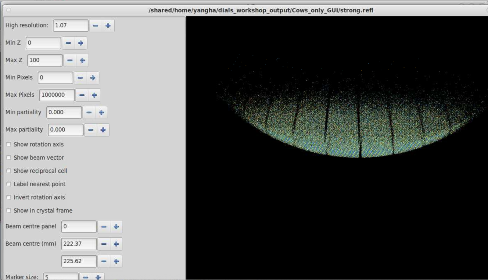

## Indexing and Refinement

If you played with the lattice viewer in the previous step you will have seen some nice lattices. The computational approach to finding them is `dials.index`: you pass the experiments and the spots and it will puzzle everything out. Here, we have multiple lattices so we need to tell the program that: click **4. Index**, tick **multi-crystal (joint=false)** - or type `joint=false` into **Additional parameters**, as in the screenshot - and check that the command reads `dials.index imported.expt strong.refl joint=false`. Then click **Run dials.index**.

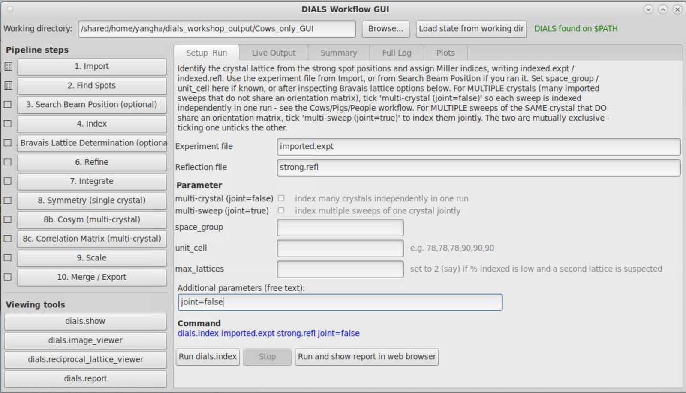

This will go through and assign a lattice for each run - in the **Live Output** you will see `Indexing imageset id 6 (7/12)` and so on, each with its own unit cell and a `% indexed` table:

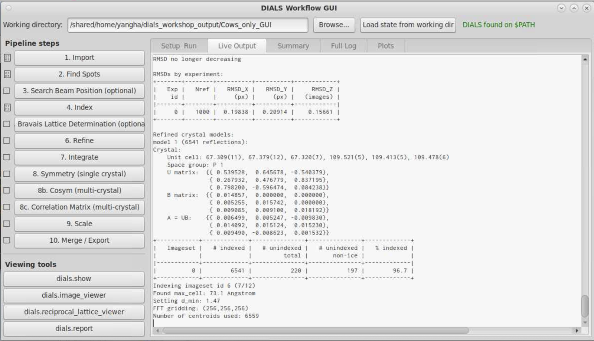

You can best look at what it has done by again using the reciprocal lattice viewer and this time passing the output, `indexed.expt` and `indexed.refl`. If you select **Show in crystal frame** (and **Show reciprocal cell**) you can see how the lattices _may_ align in reciprocal space - at this point we don't have a true understanding of the symmetry, only the unit cell, but already you can check for things like preferred orientation. With these data, the distribution looks like:

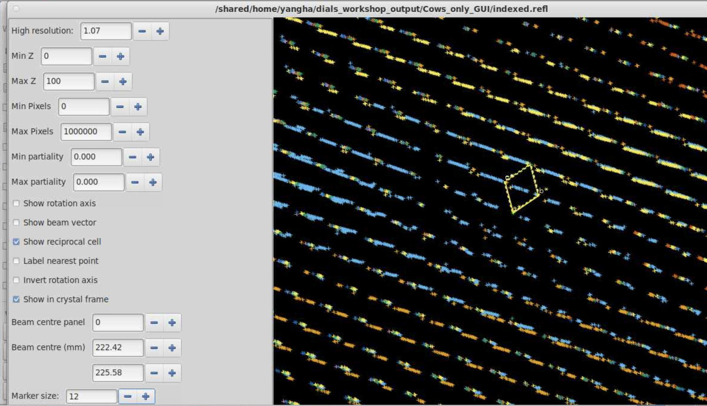

i.e. there is no evidence of preferential orientation. The same view is also available in a browser-based reciprocal lattice viewer, which needs no local DIALS installation and can be shared as a link - the indexed cows data are at [yangha7.github.io/VR_DIALS](https://yangha7.github.io/VR_DIALS/ReciprocalLatticeViewerHeadless.html?dataset=round1), with the same crystal-frame and reciprocal-cell options in the panel on the left and one colour per crystal:

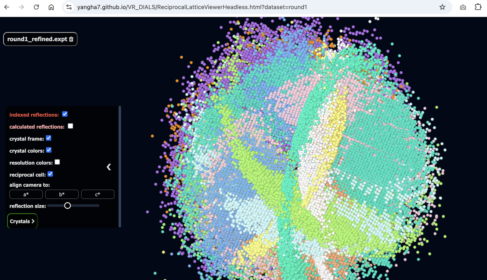

Obviously at this point we would hope that the data have a consistent unit cell - you can look at this by switching on the unit cell view in the reciprocal lattice viewer, or by clicking **dials.show** on `indexed.expt` and scanning the output for the `Unit cell:` lines (on the command line you would pipe this through `grep "Unit cell"`), which should look like:

```
    Unit cell: 67.459(10), 67.524(8), 67.498(7), 109.470(2), 109.519(4), 109.401(4)
    Unit cell: 67.442(10), 67.423(9), 67.377(7), 109.432(5), 109.421(4), 109.507(5)
    Unit cell: 67.279(9), 67.246(5), 67.248(5), 109.3630(16), 109.500(4), 109.517(4)
    Unit cell: 67.456(8), 67.478(9), 67.505(6), 109.496(4), 109.488(3), 109.392(4)
    Unit cell: 67.61(2), 67.465(12), 67.472(11), 109.474(3), 109.457(8), 109.491(8)
    Unit cell: 67.307(10), 67.333(6), 67.317(7), 109.4589(13), 109.420(5), 109.486(3)
    Unit cell: 67.342(11), 67.370(6), 67.380(6), 109.4701(10), 109.458(4), 109.484(4)
    Unit cell: 67.361(9), 67.346(9), 67.230(13), 109.517(6), 109.429(5), 109.489(2)
    Unit cell: 67.489(12), 67.464(8), 67.454(8), 109.479(2), 109.427(6), 109.467(4)
    Unit cell: 67.306(14), 67.316(13), 67.287(9), 109.439(5), 109.463(6), 109.470(6)
    Unit cell: 67.503(9), 67.554(5), 67.480(7), 109.475(2), 109.398(4), 109.516(4)
    Unit cell: 67.404(11), 67.421(6), 67.419(7), 109.449(2), 109.479(5), 109.474(5)
```

Here we can see they are all variations on a theme of 67Å / 109° x 3 - what I would expect for cubic insulin. If there are outliers you can re-run indexing with the known cell as a prior, by typing `67,67,67,109,109,109` into the **unit_cell** field on the Index panel (equivalent to `unit_cell=67,67,67,109,109,109` on the command line) to give consistency: this is not necessary here.

After indexing, we can refine the models used to describe the data - this allows for e.g. variations in the unit cell parameters or small amounts of movement of the crystal with respect to the goniometer. Click **6. Refine** - the inputs default to `indexed.expt` / `indexed.refl` - and **Run dials.refine**.

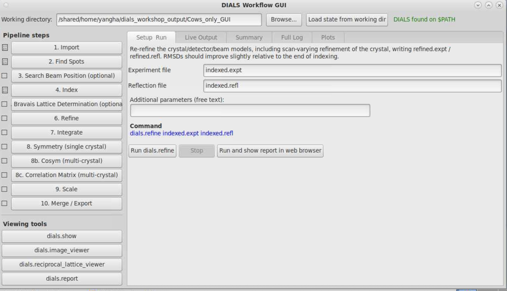

The refinement will improve the alignment between where the spots are observed to be and where they are calculated to be from the current models, which ideally should be substantially under a pixel. Each experiment is refined in turn, so the **Live Output** shows an `RMSDs by experiment` table for each:

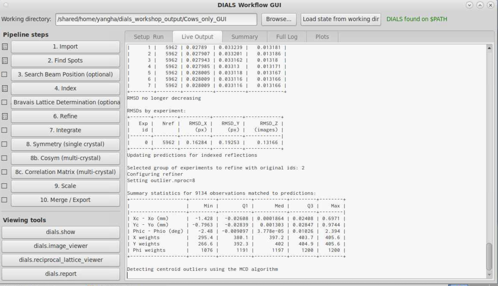

Collected together (as they appear on the command line) the final RMSDs look like:

```
RMSDs by experiment:
+-------+--------+----------+----------+------------+
|   Exp |   Nref |   RMSD_X |   RMSD_Y |     RMSD_Z |
|    id |        |     (px) |     (px) |   (images) |
|-------+--------+----------+----------+------------|
|     0 |   4357 |  0.14889 |  0.17023 |   0.11384  |
|     1 |   5744 |  0.16005 |  0.18727 |   0.13167  |
|     2 |   7394 |  0.18018 |  0.20274 |   0.12098  |
|     3 |   5806 |  0.15758 |  0.19395 |   0.092621 |
|     4 |   3202 |  0.16366 |  0.18025 |   0.17487  |
|     5 |   4672 |  0.15909 |  0.18351 |   0.12361  |
|     6 |   5083 |  0.16466 |  0.17997 |   0.087815 |
|     7 |   3589 |  0.17571 |  0.20227 |   0.11977  |
|     8 |   4545 |  0.17111 |  0.1968  |   0.13475  |
|     9 |   5350 |  0.20085 |  0.24863 |   0.17832  |
|    10 |   5765 |  0.1588  |  0.1747  |   0.086947 |
|    11 |   5718 |  0.17015 |  0.18516 |   0.081736 |
+-------+--------+----------+----------+------------+
```

in this case.

## Integration

Given a refined model, we need to now compute the locations of all the spots on the images and measure their intensities: this process has a few steps:

- calculation of the location of all the spots from the current model
- estimation of the spot dimensions modelled as Gaussians on the image and in rotation
- gathering of the spot to compute a reciprocal space "average" spot shape
- scaling this against the observed spots on the images

For education, these steps can be run somewhat independently (e.g. using `dials.create_profile_model` and `dials.predict`) which can allow inspection of what the models are _before_ attempting integration, which can be useful for investigating problematic data sets. Actual integration is **7. Integrate**: the inputs default to `refined.expt` / `refined.refl`, so click **Run dials.integrate**.

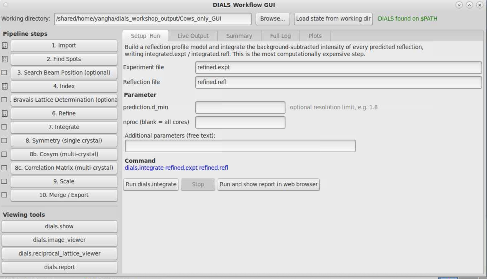

Which will take some time (about 15 minutes on 8 cores here - the progress and the per-block reflection counts scroll past in **Live Output**). Viewing the results of integration can be reassuring, but is generally not necessary (use **dials.image_viewer** with `integrated.expt` and `integrated.refl`):

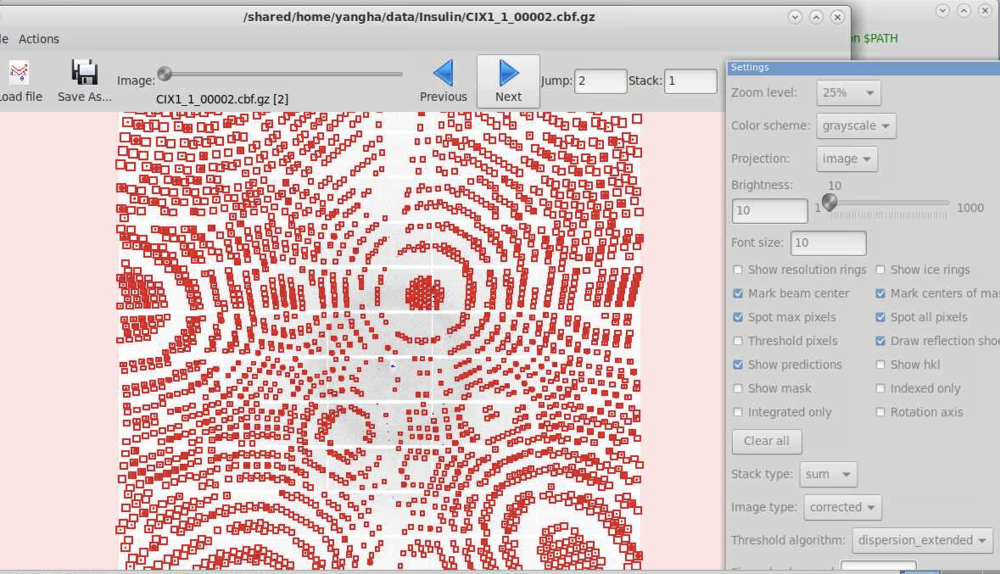

This step can be computationally challenging for substantial data sets but for this set it should be pretty quick.

## Symmetry Determination and Scaling

Up to now all of the processing has ignored the crystal symmetry, working with a triclinic cell. For scaling the symmetry relationships between reflections are needed. For a single sweep data set, `dials.symmetry` (**8. Symmetry (single crystal)**) will determine the Patterson symmetry and frequently the correct space group. In this case we have 12 data sets which are individually rather incomplete, and we know there is some indexing ambiguity i.e. the lattice symmetry is higher than the rotational symmetry of the data.

For this tutorial we have 12 data sets, so we will use `dials.cosym` to derive the symmetry and resolve indexing ambiguity simultaneously: skip step 8 and click **8b. Cosym (multi-crystal)** instead. The inputs default to `integrated.expt` / `integrated.refl`; click **Run dials.cosym (optional)**.

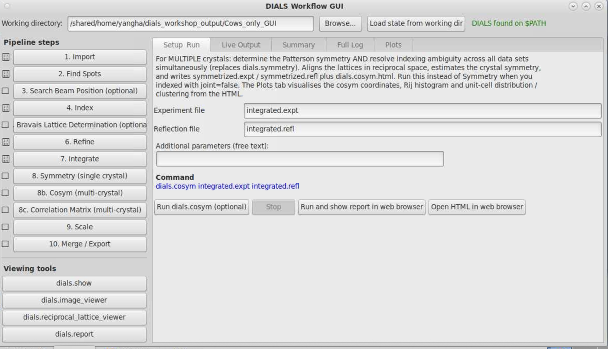

This will first try and align the lattices in reciprocal space, then estimates the crystal symmetry based on the alignment: in this case identifying the Patterson symmetry `I m -3` with close to half-half split across the "twin" operation:

```
Best solution: I m -3
Unit cell: 77.855, 77.855, 77.855, 90.000, 90.000, 90.000
Reindex operator: -b-c,a+c,-a-b
Laue group probability: 1.000
Laue group confidence: 1.000
Reindexing operators:
x,y,z: [2, 3, 5, 10, 11]
-x+y,y,y-z: [0, 1, 4, 6, 7, 8, 9]
```

In many cases there will be no indexing ambiguity, so there will only be one reindexing operation. The two groups are very visible in the **Plots** tab, which pulls the graphs out of `dials.cosym.html`: the cosym coordinates fall into two tight clusters (the two indexing choices), the R<sub>ij</sub> histogram is bimodal, and the unit cell plots show how tightly the twelve cells agree:

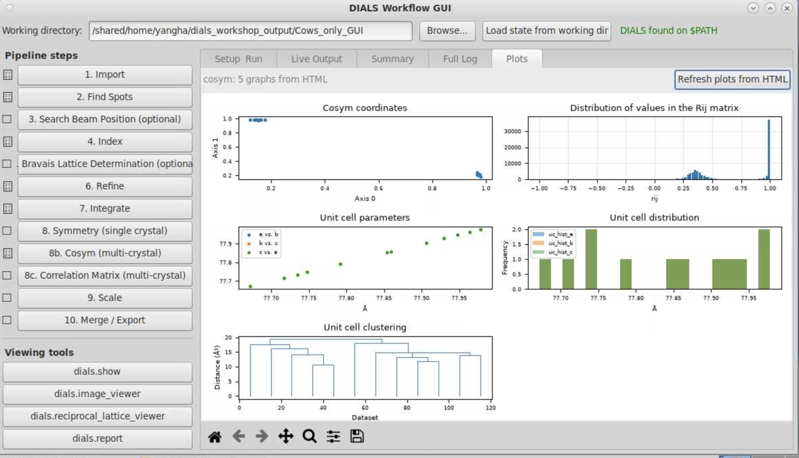

After deriving the symmetry the data can be placed onto a common scale with `dials.scale`: this adjusts the scale factors to accomodate:

- variation in illuminated volume / beam intensity
- sample decay as modelled by a temperature factor
- sample absorption (though not in this case as the sweeps are narrow)

This is the first point where we can really assess the quality and completeness of the data, and the resolution of diffraction. The initial scaling is **9. Scale** with everything left at the defaults - the inputs are `symmetrized.expt` / `symmetrized.refl`, **Cluster to scale** stays on `(none - use inputs above)`, and **anomalous** is unticked:

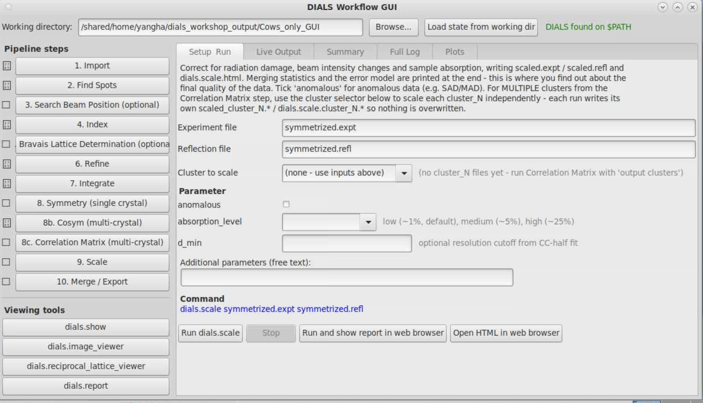

Click **Run dials.scale**. This will produce a _lot_ of output then:

```
Resolution limit suggested from CC½ fit (limit CC½=0.3): 1.27
```

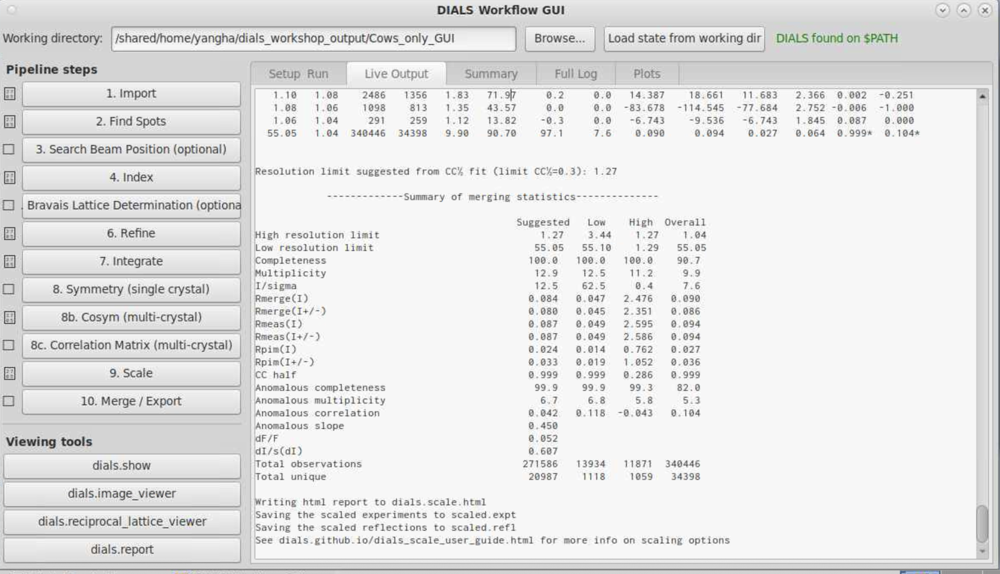

(The original command-line tutorial got 1.26 here; small differences like this between DIALS versions are normal and make no difference to the outcome.) At this point it is up to the user to decide the resolution of the data to keep, but at this stage we have no more insight than this, so type `1.27` into the **d_min** field and run the step again - the command becomes `dials.scale symmetrized.expt symmetrized.refl d_min=1.27`:

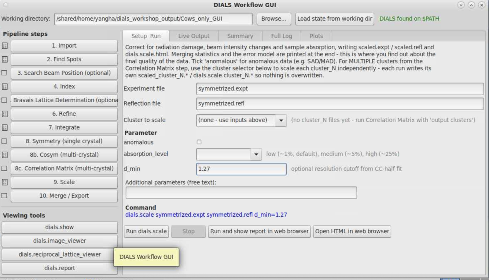

is a rational action. This gives the table of merging statistics (the numbers below are those at the suggested 1.27 Å limit) but more importantly a long log file in HTML format with useful graphs - click **Open HTML in web browser** to see `dials.scale.html`. The "table 1" is included at the end which usually gives a good indication of data quality:

```
                                             Overall    Low     High
High resolution limit                           1.27    3.44    1.27
Low resolution limit                           55.05   55.10    1.29
Completeness                                  100.0   100.0   100.0
Multiplicity                                   12.9    12.5    11.2
I/sigma                                        12.5    62.5     0.4
Rmerge(I)                                     0.084   0.047   2.476
Rmerge(I+/-)                                  0.080   0.045   2.351
Rmeas(I)                                      0.087   0.049   2.595
Rmeas(I+/-)                                   0.087   0.049   2.586
Rpim(I)                                       0.024   0.014   0.762
Rpim(I+/-)                                    0.033   0.019   1.052
CC half                                       0.999   0.999   0.286
Anomalous completeness                         99.9    99.9    99.3
Anomalous multiplicity                          6.7     6.8     5.8
Anomalous correlation                         0.042   0.118  -0.043
Anomalous slope                               0.450
dF/F                                          0.052
dI/s(dI)                                      0.607
Total observations                           271586   13934   11871
Total unique                                  20987    1118    1059
```

## Isomorphism and Clustering

In the processing so far, we have assumed that the data are isomorphous i.e. merge together well but we have not _tested_ this hypothesis. DIALS now has a tool (`dials.correlation_matrix`) to measure the similarity of data sets and cluster isomorphous ones. In the GUI this is **8c. Correlation Matrix (multi-crystal)**: by default it runs on `symmetrized.expt` / `symmetrized.refl`, _or_ you can tick **use scaled data** to run it on `scaled.expt` / `scaled.refl` instead. The **output clusters** box (ticked by default) adds `significant_clusters.output=True` so that any clusters found are written out as separate files.

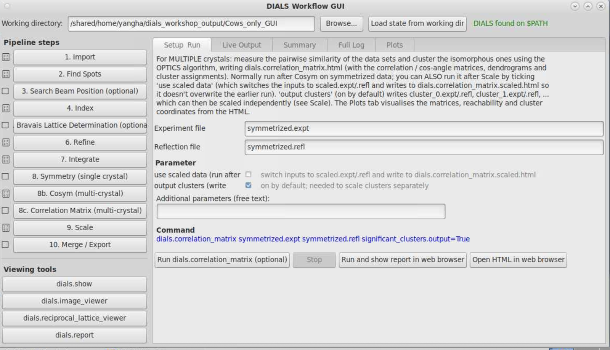

Click **Run dials.correlation_matrix (optional)**. This will classify the data into one cluster with no outliers, which aligns well with the preconceptions exposed above. The program may take either scaled data, which may be biased but will show clearer clusters, or unscaled data which is less biased but may be more "fuzzy" - you may find you get a clearer signal one way or the other.

```
Evaluating Significant Clusters from Cosine-Angle Coordinates:
Using OPTICS Algorithm (M. Ankerst et al, 1999, ACM SIGMOD)
Setting Minimum Samples to 5
OPTICS identified 1 clusters and 0 outlier datasets.
Cluster 0
  Number of datasets: 12
  Completeness: 90.2 %
  Multiplicity: 9.55
  Datasets:0,1,2,3,4,5,6,7,8,9,10,11
For separated clusters in DIALS .expt/.refl output please re-run with significant_clusters.output=True
Saving graphical output of correlation matrices to dials.correlation_matrix.html.
```

Here it is well worth looking at the HTML output (**Open HTML in web browser**), or the **Plots** tab, which shows the correlation and cos(angle) matrices, the OPTICS reachability plot and the cosym coordinates. With only cows in the mix every data set correlates with every other at better than 0.96, so the matrices are a uniform block and OPTICS finds a single cluster - keep this picture in mind for comparison with the second half:

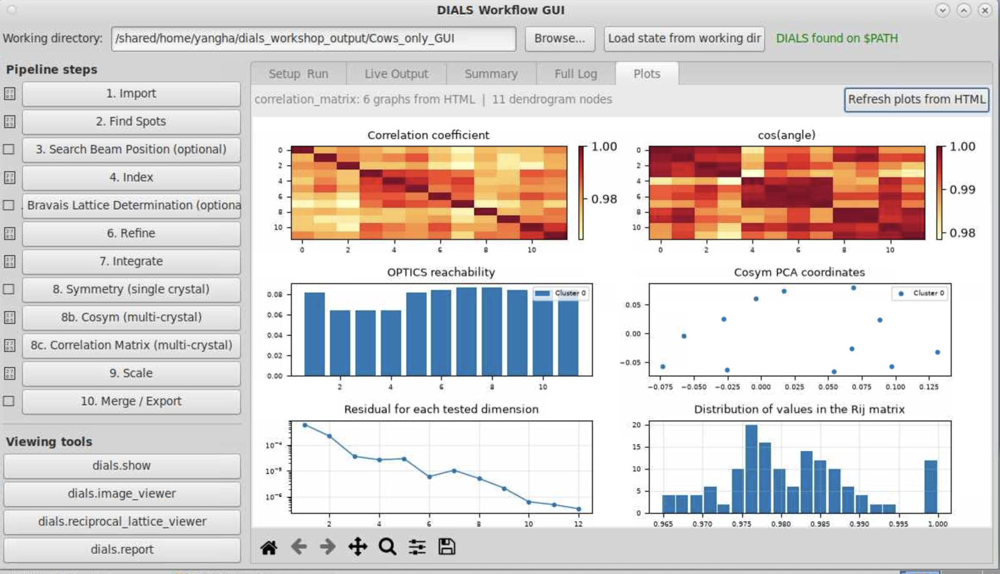

We have no need to split the data as there _is_ only one cluster and no outliers, so we did the right thing above just scaling the data. However it is not always that way.

## Cows, Pigs and People

Now, let's re-do all the above steps but this time with a mixture of data sets: 12 each from human, bovine and porcine insulin. On a coarse scale they are isomorphous, but obviously deviate from one another at the scale of individual residues: this split is small enough that we could accidentally merge the data from all crystals if we were not careful: let's be careful. But first, let's be ignorant and see how that works out!

Going back to the instructions above, we carefully imported just the `CIX` data (selecting only the `CIX*.cbf.gz` files in the Import file dialog, i.e. `dials.import ../data/CIX*gz`). This time around, we will be importing _all_ the data and proceeding as before as far as the `dials.cosym` step - but using the DIALS Workflow GUI rather than typing the commands. Launch the GUI and set the **Working directory** to a fresh, empty directory (here `CCP_GUI`) so the new run does not overwrite the cows-only processing. The steps are the same six programs as before; the command the GUI is about to run is always shown in blue, so you can compare with the command-line version at every stage.

### Import

Click **1. Import**, then **Browse files...**, navigate to the data directory and select _all_ of the `.cbf.gz` images from all 36 crystals (click the first, shift-click the last, or Ctrl-A). Alternatively **Add glob pattern...** with `../data/*gz` does the same thing in one line.

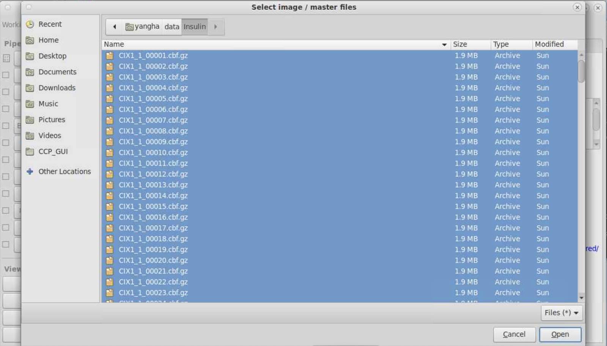

The file list fills up with the selected images - the command preview under it is now very long, which is exactly why `dials.import ../data/*gz` is the usual way to do this from a terminal. Leave the image range blank and click **Run dials.import**.

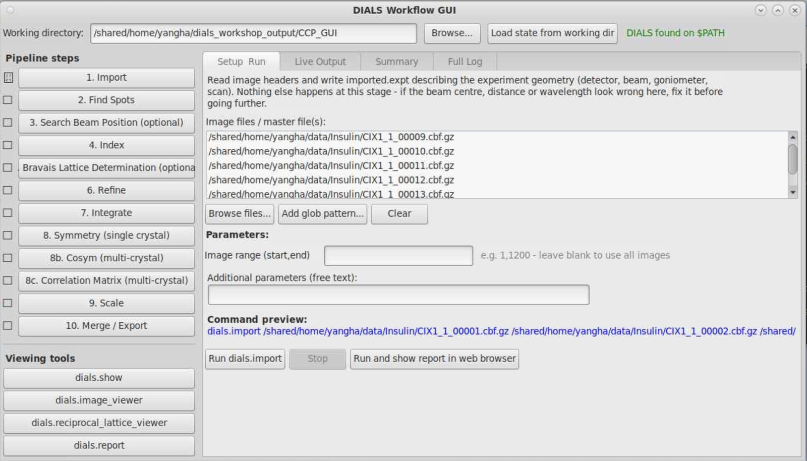

Reading the headers of 3600 images takes a couple of minutes; progress is shown in **Live Output**. The end of the output should list 36 templates and `sweep: 36`.

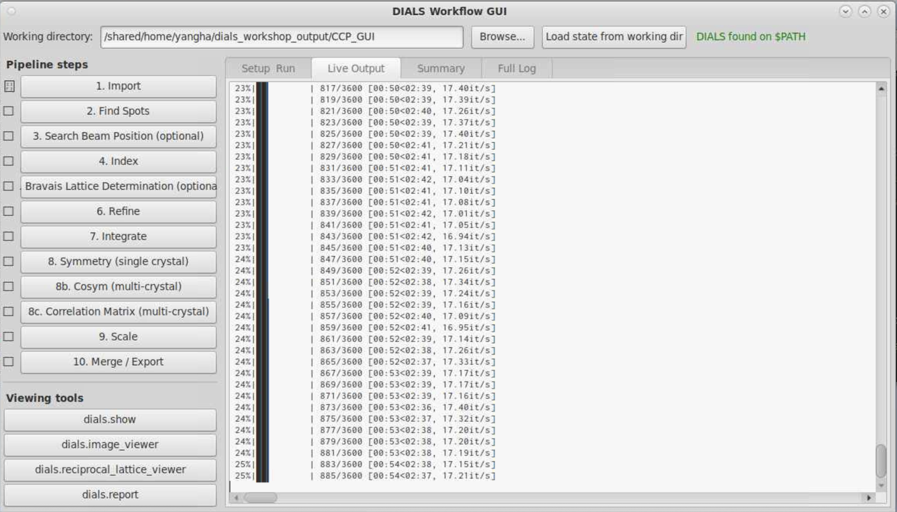

### Find Spots

Click **2. Find Spots**. The experiment file is already `imported.expt`; click **Run dials.find_spots**.

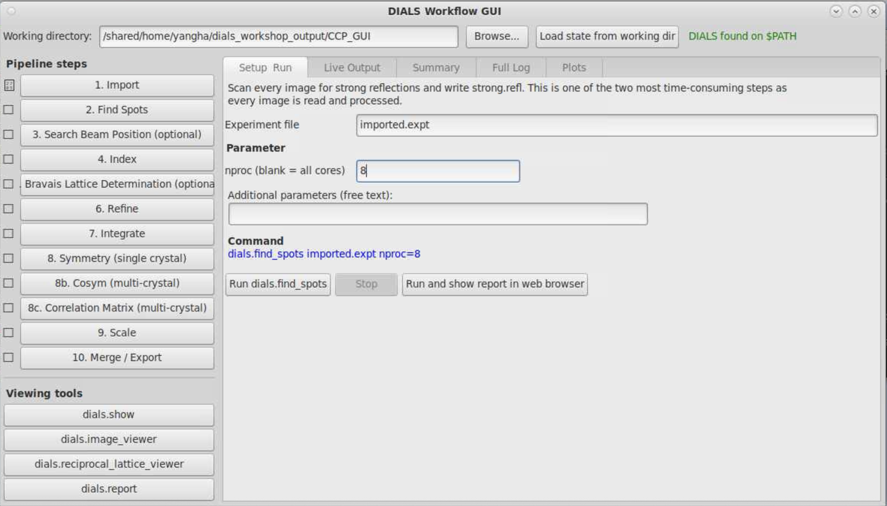

As before you get a per-image histogram for each of the 36 imagesets, and this time around 268,000 strong reflections in total:

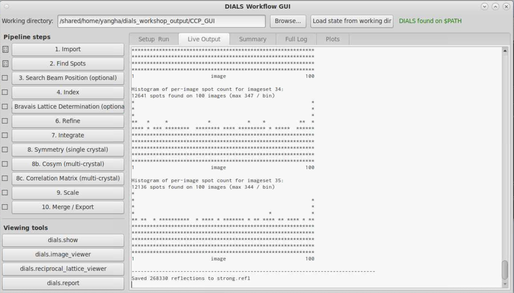

### Index

Click **4. Index**. This is the one step where the multi-crystal case differs from the single-crystal workflow: we must tell the program that the crystals _do not_ share an orientation matrix. Tick **multi-crystal (joint=false)** - or, equivalently, type `joint=False` into the **Additional parameters** box as in the screenshot - and check that the command reads `dials.index imported.expt strong.refl joint=False`. Then click **Run dials.index**.

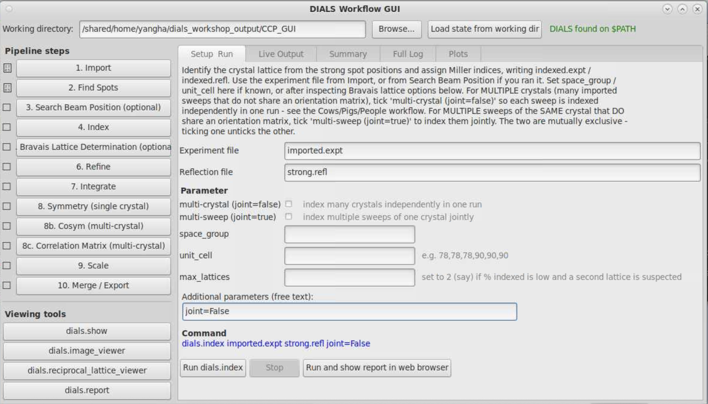

The output shows each imageset being indexed in turn (`Indexing imageset id 17 (18/36)` and so on), each with its own unit cell, all of which should again be variations on 67 Å / 109°:

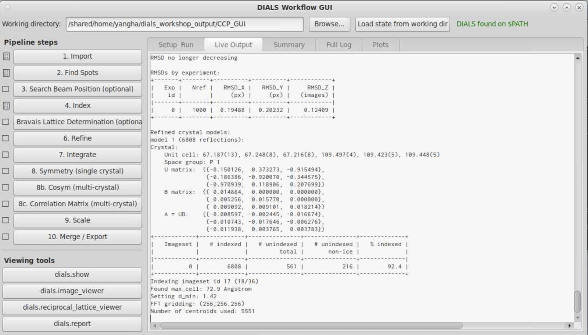

### Refine and Integrate

Click **6. Refine** and **Run dials.refine**, then **7. Integrate** and **Run dials.integrate** - in both cases the input files are filled in from the previous step and no parameters need changing. Integration of 36 sweeps will take a little while.

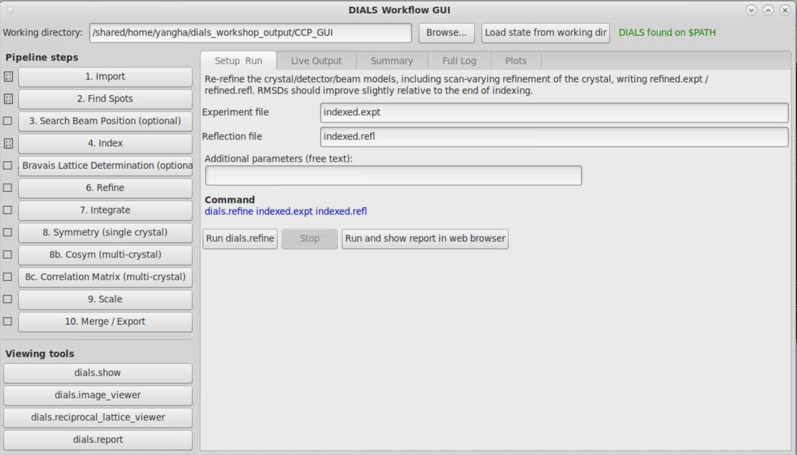

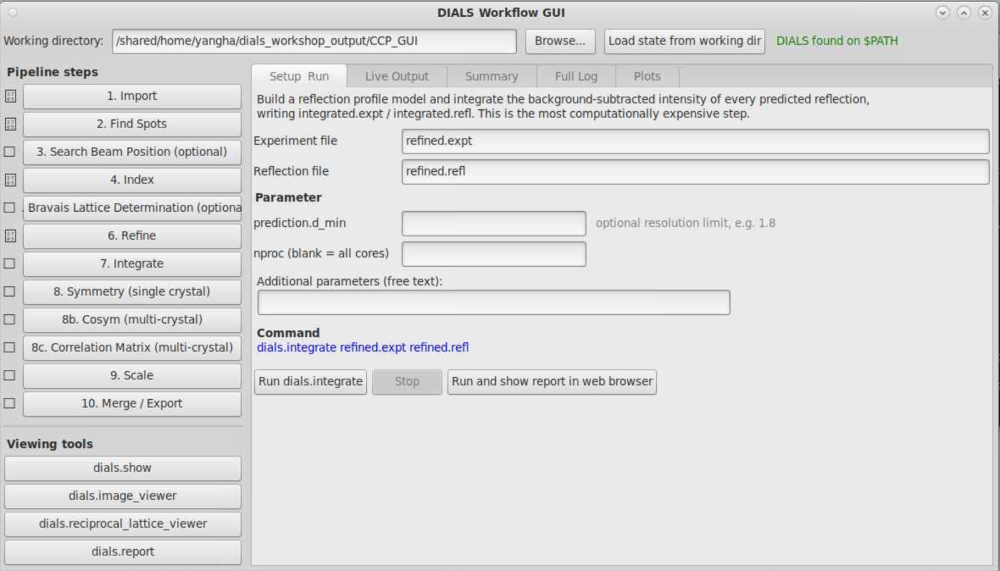

### Cosym

Skip **8. Symmetry (single crystal)** - that is `dials.symmetry`, for one crystal. Click **8b. Cosym (multi-crystal)** instead; the inputs default to `integrated.expt` / `integrated.refl`. Click **Run dials.cosym (optional)**.

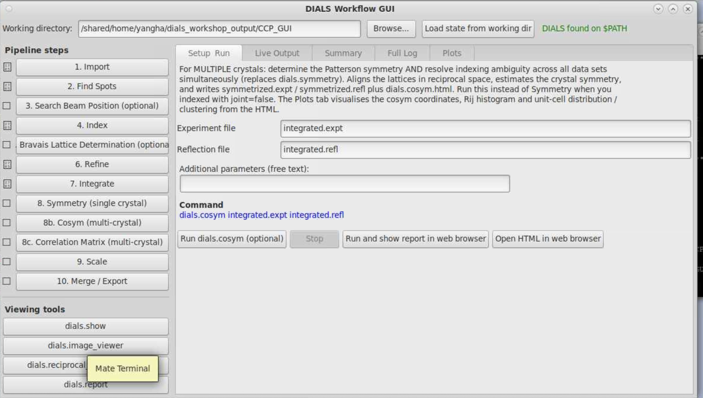

At this point we have found a common symmetry and indexing setting, and derived an average unit cell (this is the end of the `dials.cosym` output in the **Live Output** tab):

```
Best solution: I m -3
Unit cell: 77.842, 77.842, 77.842, 90.000, 90.000, 90.000
Reindex operator: -b-c,a+c,-a-b
Laue group probability: 1.000
Laue group confidence: 1.000
Reindexing operators:
-x+y,y,y-z: [2, 3, 5, 10, 11, 13, 14, 15, 16, 18, 19, 20, 21, 22, 27, 34, 35]
x,y,z: [0, 1, 4, 6, 7, 8, 9, 12, 17, 23, 24, 25, 26, 28, 29, 30, 31, 32, 33]
```

however at this stage we can also start looking at the isomorphism analysis performed by cosym, by looking at `dials.cosym.html` (the **Open HTML in web browser** button, or the **Plots** tab) - this includes some measure of unit cell isomorphism, but from the dendrogram you can see it does not cleanly split into three categories:


Scaling the data (**9. Scale**) is "succcessful" in that you get results, but the merging stats are pretty poor. Looking at the logs you can see the data split (not shown) but it is not obvious unless you know in advance that there are different crystals here. Take a look at `dials.scale.html` and look at the merging statistics as a function of image / batch number.

### Correlation Matrix

We can however see the different groups if we run `dials.correlation_matrix` - a new tool to run after cosym which helps to look for different isomorphism classes. This is rather more helpful: using the correlation coefficients to define distances, then using the OPTICS algorithm to define clusters. Click **8c. Correlation Matrix (multi-crystal)**. The inputs default to `symmetrized.expt` / `symmetrized.refl`, and **output clusters** is ticked by default, which adds `significant_clusters.output=True` to the command so that the clusters are written out as separate files (see below). Click **Run dials.correlation_matrix (optional)**.

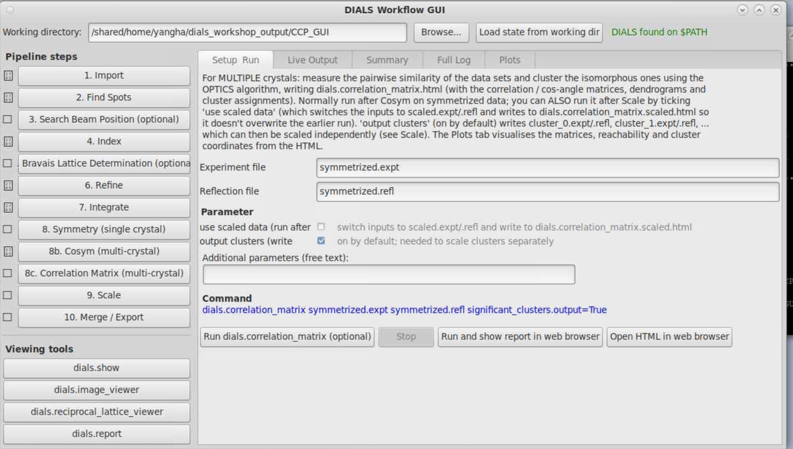

This will recommend clusters:

```
Cluster 0
  Number of datasets: 12
  Completeness: 90.2 %
  Multiplicity: 9.55
  Datasets:0,1,2,3,4,5,6,7,8,9,10,11
Cluster 1
  Number of datasets: 12
  Completeness: 90.0 %
  Multiplicity: 9.52
  Datasets:12,13,14,15,16,17,18,19,20,21,22,23
Cluster 2
  Number of datasets: 12
  Completeness: 90.0 %
  Multiplicity: 9.51
  Datasets:24,25,26,27,28,29,30,31,32,33,34,35
```

but more usefully shows the lattice separation superbly on a pairwise correlation matrix, as modified using the cosine-angle procedure from `cosym`[2,3]:


Here you can clearly see the three clusters. The GUI's **Plots** tab pulls the same graphs out of `dials.correlation_matrix.html` - the correlation and cos(angle) matrices, the OPTICS reachability plot coloured by cluster, and the cosym coordinates - and here the three-way split is unmistakable:

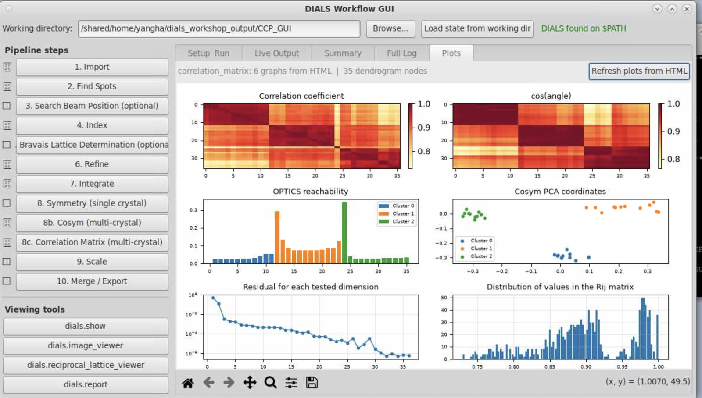

Because **output clusters** was ticked (`significant_clusters.output=True` on the command line), the program has also split the data according to the clusters for further analysis:

```
-rw-r--r--   1 graeme  staff     528939 14 Oct 14:19 cluster_0.expt
-rw-r--r--   1 graeme  staff  150001603 14 Oct 14:19 cluster_0.refl
-rw-r--r--   1 graeme  staff     527726 14 Oct 14:19 cluster_1.expt
-rw-r--r--   1 graeme  staff  147913867 14 Oct 14:19 cluster_1.refl
-rw-r--r--   1 graeme  staff     528436 14 Oct 14:19 cluster_2.expt
-rw-r--r--   1 graeme  staff  151291087 14 Oct 14:19 cluster_2.refl
```

These can be scaled as above. In the GUI, go to **9. Scale** and pick each cluster in turn from the **Cluster to scale** drop-down - each run writes its own `scaled_cluster_N.expt` / `scaled_cluster_N.refl` and `dials.scale.cluster_N.html`, so nothing is overwritten. The algorithm may leave outlier data sets from inclusion in any cluster, so it is possible only one cluster appears as a result. From the command line the equivalent is to make a directory for each; in this case I merged each cluster separately with:

```
mkdir 0 1 2
cd 0
dials.scale ../cluster_0.expt ../cluster_0.refl
cd ../1
dials.scale ../cluster_1.expt ../cluster_1.refl
cd ../2
dials.scale ../cluster_2.expt ../cluster_2.refl
cd ..
```

Individually the merging statistics from each cluster look far better than the three combined.

## Automation

This is a manual process which allows you to look closely at your data. A more automated approach to this can be via `xia2.multiplex` [1] which automates much of the process. That isn't however the objective of this tutorial.

## References

1. [xia2.multiplex](https://journals.iucr.org/d/issues/2022/06/00/gm5092/)
2. [dials.cosym](https://journals.iucr.org/d/issues/2018/05/00/rr5155/)
3. [Brehm-Diederichs algorithm](https://journals.iucr.org/d/issues/2014/01/00/wd5226/)
